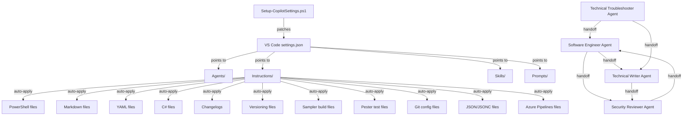

# System patterns

## Architecture overview

```
~/CopilotAtelier/        # Local mirror, always populated by the setup script
~/OneDrive/CopilotAtelier/   # Optional OneDrive-synced mirror
├── Agents/              # .agent.md files — AI personas with tools and handoffs
├── Instructions/        # .instructions.md files — auto-applied coding standards
├── Skills/              # <name>/SKILL.md — on-demand expertise loaded by agents
├── Prompts/             # .prompt.md files — reusable slash-command templates
├── Reference/           # Reference docs that are NOT auto-attached instructions
├── .memory-bank/        # Project knowledge base (this directory)
├── .vscode/             # Workspace-level VS Code settings
├── Setup-CopilotSettings.ps1  # One-command machine setup
└── README.md            # Project documentation
```

## Key technical decisions

### Decision 1: OneDrive as sync mechanism

- **Choice**: Use OneDrive file sync rather than a custom sync service or git-based distribution.
- **Rationale**: OneDrive is already available on all target machines; no additional infrastructure needed. VS Code's Copilot file-location settings accept `~/OneDrive/` paths natively.
- **Trade-off**: Requires OneDrive sign-in; conflicts resolved by OneDrive's sync engine, not git merge.

### Decision 2: JSONC-tolerant settings patching

- **Choice**: The setup script strips `//` comments and `/* */` block comments before parsing `settings.json`.
- **Rationale**: VS Code's `settings.json` is JSONC (JSON with Comments), but PowerShell's `ConvertFrom-Json` does not support comments. Stripping them avoids parse errors.
- **Trade-off**: Comments are not preserved after the script writes back the file.

### Decision 3: Idempotent merge strategy

- **Choice**: The `Merge-LocationSetting` helper function preserves existing keys and only adds/overwrites the OneDrive paths.
- **Rationale**: Users may have manually added other custom paths to the location settings. Replacing the entire setting would destroy those entries.

### Decision 4: Agent handoff architecture

- **Choice**: Agents define `handoffs` in YAML frontmatter to transfer context to other agents.
- **Rationale**: Enables a release pipeline workflow: Software Engineer → Security Reviewer → Technical Writer, with each agent able to hand off to the next without losing context.
- **Pattern**:
  - `software-engineer` can hand off to `security-reviewer` and `technical-writer`
  - `security-reviewer` can hand off to `software-engineer` (for fixing issues)
  - `technical-writer` can hand off to `security-reviewer` (for documentation review)
  - `technical-troubleshooter` can hand off to `software-engineer` (for implementing fixes)
- **Agent organization**: Core SDLC pipeline (Software Engineer, Security & QA, Technical Writer, Technical Troubleshooter) + Supplementary domain-specific (Legal Researcher, Tax Researcher, QC Inspector, Training Content Writer, DevOps Training Writer, Career Coach).
- **Inheritance**: DevOps Training Writer inherits all generic training rules from Training Content Writer.

### Decision 5: Instruction files with `applyTo` globs

- **Choice**: Each instruction file declares which file patterns it applies to via `applyTo` in YAML frontmatter.
- **Rationale**: VS Code automatically loads the relevant instruction file when the developer is working on a matching file type. No manual activation needed.
- **Mapping**:
  - `powershell.instructions.md` → `**/*.ps1,**/*.psm1,**/*.psd1`
  - `powershell-execution-safety.instructions.md` → PowerShell source + Pester + build files (detached execution, Pester-in-subprocess)
  - `markdown.instructions.md` → `**/*.md`
  - `yaml.instructions.md` → `**/*.yml,**/*.yaml`
  - `csharp.instructions.md` → `**/*.cs,**/*.csx`
  - `changelog.instructions.md` → `**/CHANGELOG.md` and variants
  - `versioning.instructions.md` → `**/GitVersion.yml,**/*.psd1,**/CHANGELOG.md`
  - `sampler.instructions.md` → `**/build.yaml,**/build.ps1,**/RequiredModules.psd1,...,**/Datum.yml` (slim enforced rules only; reference content moved to `sampler-framework` skill)
  - `copilot-authoring.instructions.md` → `Instructions/*.instructions.md, Prompts/*.prompt.md, Skills/**/SKILL.md, Agents/*.agent.md` (meta-rules governing this repo's own content)
  - `pester.instructions.md` → `**/*.Tests.ps1,**/*.tests.ps1`
  - `git.instructions.md` → `**/.gitconfig,**/.gitignore,**/.gitattributes,**/COMMIT_EDITMSG`
  - `json.instructions.md` → `**/*.json,**/*.jsonc`
  - `azurepipelines.instructions.md` → `**/azure-pipelines.yml,**/azure-pipelines*.yml,**/.azuredevops/*.yml`
  - `Reference/copilot-cli-model-routing.md` → Reference doc (4-tier Copilot CLI model routing); not auto-attached

### Decision 6: Skills require YAML frontmatter

- **Choice**: Every `SKILL.md` must start with YAML frontmatter containing `name` and `description`.
- **Rationale**: VS Code cannot discover or register skills without this metadata. The `description` field should include `USE FOR` and `DO NOT USE FOR` trigger phrases.

### Decision 7: Claude Opus 4.7 as default model

- **Choice**: All agents declare `Claude Opus 4.7 (copilot)` and the setup script configures GitLens and inline completions to use `claude-opus-4.7`.
- **Rationale**: Opus 4.7 is GA in Copilot since 2026-04-16 and is Anthropic's announced replacement for Opus 4.5 / 4.6. The previous default (`claude-opus-4.6-fast`) was retired on 2026-04-10.
- **Trade-off**: Opus 4.7 requires Copilot Pro+, Business, or Enterprise; other plans fall back to the VS Code default.

## Component relationships



## Prompt-to-agent binding

Prompt files use the `agent:` frontmatter attribute to specify which custom agent runs the prompt. Valid values: `ask`, `agent`, `plan`, or a custom agent `name` from the Agents folder.

| Prompt | Agent |
|---|---|
| `code-review` | `security-reviewer` |
| `deadline-action-handoff` | `legal-researcher` |
| `export-emails` | `legal-researcher` |
| `sync-project-emails` | `legal-researcher` |
| `lab-deploy` | `software-engineer` |
| `module-scaffold` | `software-engineer` |
| `pr-description` | `software-engineer` |
| `refactor` | `software-engineer` |

## File naming conventions

| Component | Naming pattern | Example |
|---|---|---|
| Agents | `<Descriptive Name>.agent.md` | `Software Engineer Agent.agent.md` |
| Instructions | `<language-or-topic>.instructions.md` | `powershell.instructions.md` |
| Skills | `<skill-name>/SKILL.md` | `sampler-build-debug/SKILL.md` |
| Prompts | `<task-name>.prompt.md` | `code-review.prompt.md` |
