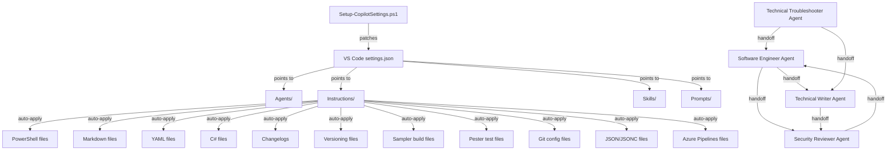

# System patterns

## Architecture overview

```
~/CopilotAtelier/        # Local mirror, always populated by the setup script
~/OneDrive/CopilotAtelier/   # Optional OneDrive-synced mirror
├── Agents/              # .agent.md files — AI personas with tools and handoffs
├── Instructions/        # .instructions.md files — auto-applied coding standards
├── Skills/              # <name>/SKILL.md — on-demand expertise loaded by agents
├── Prompts/             # .prompt.md files — reusable slash-command templates
├── Reference/           # Reference docs that are NOT auto-attached instructions
├── .memory-bank/        # Project knowledge base (this directory)
├── .vscode/             # Workspace-level VS Code settings
├── Setup-CopilotSettings.ps1  # One-command machine setup
└── README.md            # Project documentation
```

## Key technical decisions

### Decision 1: OneDrive as sync mechanism

- **Choice**: Use OneDrive file sync rather than a custom sync service or git-based distribution.
- **Rationale**: OneDrive is already available on all target machines; no additional infrastructure needed. VS Code's Copilot file-location settings accept `~/OneDrive/` paths natively.
- **Trade-off**: Requires OneDrive sign-in; conflicts resolved by OneDrive's sync engine, not git merge.

### Decision 2: JSONC-tolerant settings patching

- **Choice**: The setup script strips `//` comments and `/* */` block comments before parsing `settings.json`.
- **Rationale**: VS Code's `settings.json` is JSONC (JSON with Comments), but PowerShell's `ConvertFrom-Json` does not support comments. Stripping them avoids parse errors.
- **Trade-off**: Comments are not preserved after the script writes back the file.

### Decision 3: Idempotent merge strategy

- **Choice**: The `Merge-LocationSetting` helper function preserves existing keys and only adds/overwrites the OneDrive paths.
- **Rationale**: Users may have manually added other custom paths to the location settings. Replacing the entire setting would destroy those entries.
- **Note (May 6, 2026)**: `Merge-LocationSetting` is retained but no longer called for `chat.*FilesLocations`. Discovery for both the VS Code Copilot chat extension and the GitHub Copilot CLI is now wired through NTFS junctions at `%USERPROFILE%\.copilot\{agents,instructions,skills,prompts}` pointing to the canonical target tree. Empty pre-existing real folders at those paths are removed silently; non-empty ones prompt the user and, on consent, are merged into the target before being removed.

### Decision 4: Agent handoff architecture

- **Choice**: Agents define `handoffs` in YAML frontmatter to transfer context to other agents.
- **Rationale**: Enables a release pipeline workflow: Software Engineer → Security Reviewer → Technical Writer, with each agent able to hand off to the next without losing context.
- **Pattern**:
  - `software-engineer` can hand off to `security-reviewer` and `technical-writer`
  - `security-reviewer` can hand off to `software-engineer` (for fixing issues)
  - `technical-writer` can hand off to `security-reviewer` (for documentation review)
  - `technical-troubleshooter` can hand off to `software-engineer` (for implementing fixes)
- **Agent organization**: Core SDLC pipeline (Software Engineer, Security & QA, Technical Writer, Technical Troubleshooter) + Supplementary domain-specific (Legal Researcher, Tax Researcher, QC Inspector, Training Content Writer, DevOps Training Writer, Career Coach).
- **Inheritance**: DevOps Training Writer inherits all generic training rules from Training Content Writer.

### Decision 5: Instruction files with `applyTo` globs

- **Choice**: Each instruction file declares which file patterns it applies to via `applyTo` in YAML frontmatter.
- **Rationale**: VS Code automatically loads the relevant instruction file when the developer is working on a matching file type. No manual activation needed.
- **Mapping**:
  - `powershell.instructions.md` → `**/*.ps1,**/*.psm1,**/*.psd1`
  - `powershell-execution-safety.instructions.md` → PowerShell source + Pester + build files (detached execution, Pester-in-subprocess)
  - `markdown.instructions.md` → `**/*.md`
  - `yaml.instructions.md` → `**/*.yml,**/*.yaml`
  - `csharp.instructions.md` → `**/*.cs,**/*.csx`
  - `changelog.instructions.md` → `**/CHANGELOG.md` and variants
  - `versioning.instructions.md` → `**/GitVersion.yml,**/*.psd1,**/CHANGELOG.md`
  - `sampler.instructions.md` → `**/build.yaml,**/build.ps1,**/RequiredModules.psd1,...,**/Datum.yml` (slim enforced rules only; reference content moved to `sampler-framework` skill)
  - `copilot-authoring.instructions.md` → `Instructions/*.instructions.md, Prompts/*.prompt.md, Skills/**/SKILL.md, Agents/*.agent.md` (meta-rules governing this repo's own content)
  - `pester.instructions.md` → `**/*.Tests.ps1,**/*.tests.ps1`
  - `git.instructions.md` → `**/.gitconfig,**/.gitignore,**/.gitattributes,**/COMMIT_EDITMSG`
  - `json.instructions.md` → `**/*.json,**/*.jsonc`
  - `azurepipelines.instructions.md` → `**/azure-pipelines.yml,**/azure-pipelines*.yml,**/.azuredevops/*.yml`
  - `Reference/copilot-cli-model-routing.md` → Reference doc (4-tier Copilot CLI model routing); not auto-attached

### Decision 6: Skills require YAML frontmatter

- **Choice**: Every `SKILL.md` must start with YAML frontmatter containing `name` and `description`.
- **Rationale**: VS Code cannot discover or register skills without this metadata. The `description` field should include `USE FOR` and `DO NOT USE FOR` trigger phrases.

### Decision 7: Claude Opus 4.8 as the agents' current model

- **Choice**: All 11 agents declare `Claude Opus 4.8 (copilot)` (bumped 2026-07-02, superseding 4.7). The `Setup-CopilotSettings.ps1` global default (`gitlens.ai.vscode.model`, `github.copilot.advanced.model`), `README.md`, and `.memory-bank/techContext.md` were bumped to Opus 4.8 in the same session, so per-agent and global-default model ids are now aligned.
- **Rationale**: Opus 4.8 is the mid-2026 current release. Keeping every model reference current avoids drift between what agents declare and what the setup script writes.
- **Trade-off**: Opus 4.8 requires a Copilot plan that offers it; other plans fall back to the VS Code default. The `Reference/copilot-cli-model-routing.md` lineup is also current: Opus → 4.8 and the deprecated GPT-5.1 family → GPT-5.5, with Sonnet 4.6 / Haiku 4.5 / gpt-5.2-5.3 / Gemini left pending the planned full rewrite.

### Decision 8: Session-handoff document convention

- **Choice**: Cross-session handoff documents are written to `.memory-bank/session/handoff-<UTC>.md` and excluded from version control.
- **Rationale**: Fresh agents in new sessions need a portable, self-contained continuation pointer when the original session ends (context saturation, model switch, machine handover). `.memory-bank/` is already on every agent's pre-flight read path; the `session/` subfolder isolates ephemera from curated knowledge. Gitignore keeps per-session artifacts out of project history — `progress.md` and `CHANGELOG.md` remain the canonical record.
- **Naming**: `handoff-YYYY-MM-DDTHHmmZ.md` (UTC, ISO-8601 compact) so multiple handoffs in one day sort. Sibling artifact `deadline-handoff-<yyyy-MM-dd-HH-mm>.md` is the older payload produced by `sync-project-emails` Phase 7a (same folder, same gitignore policy).
- **Disambiguation vs Decision 4**: "Agent-to-agent handoff" (Decision 4) is the in-session UI transfer between custom agents in the same chat (declared via `handoffs:` in agent frontmatter). "Session-handoff" is a cross-session document. Both share the word — use the qualified form when ambiguity matters.
- **Producer**: [`Prompts/session-handoff.prompt.md`](../Prompts/session-handoff.prompt.md). The folder is documented in [`.memory-bank/session/README.md`](session/README.md).

### Decision 9: markdownlint config codifies the markdown house style

- **Choice**: A repo-root [`.markdownlint.jsonc`](../.markdownlint.jsonc) disables the stylistic rules the repo intentionally violates (long lines, compact pipe tables, bare code fences, blank-line spacing, `**bold**` lead-ins, mixed list numbering, duplicate generic headings) and keeps MD047 (single trailing newline) enforced.
- **Rationale**: The repo predated any lint config and relied on each machine's lenient editor settings. Under default rules `markdownlint-cli2` reported ~5,300 violations (3383 MD013, 1208 MD060, and so on) — almost all deliberate style. Codifying the policy in one committed file makes linting deterministic in the editor, CLI, and CI, and avoids reformatting 1200+ tables.
- **Trade-off**: A few genuine correctness rules (MD051 link fragments, MD056 table-column count, MD041, MD038) are disabled-but-flagged in the config for a future fix pass rather than reformatted now.

### Decision 10: Long-running command execution (agent reliability)

- **Choice**: Commands that run for minutes to tens of minutes (live tests, integration suites, installers, deployments) are launched so they *survive and self-notify* instead of the agent busy-waiting. Two modes: **sync with no timeout** (preferred) — the terminal tool blocks, returns full output on completion, and auto-degrades to a background id plus a completion notification if it exceeds the internal cap; **async** — only for truly indefinite processes (servers, watchers, daemons, or a monitoring sidecar).
- **Rule**: The agent must **never `Start-Sleep` in its own foreground command to wait for a job**, and never hand-roll a poll loop for completion — it cannot self-schedule a timer and relies on the tool's completion notification (and on-demand checks). `Start-Sleep` is legitimate only *inside a backgrounded sidecar process*.
- **Foundation vs extension**: This is the execution foundation. [`Instructions/powershell-execution-safety.instructions.md`](../Instructions/powershell-execution-safety.instructions.md) is the narrower VS Code-freeze remedy for detached Sampler/Pester runs. The [`long-running-job-monitor`](../Skills/long-running-job-monitor/SKILL.md) skill **extends** this note with the monitoring layer: self-timestamping instrumented logs, heartbeats, out-of-band target verification, a ~5-minute status cadence, a stuck-vs-working heuristic, and completion/cleanup.
- **Rationale**: Long jobs buffer stdout and print only at the end; without instrumentation plus out-of-band checks the agent cannot tell "still working" from "hung", and without the never-self-sleep rule it burns turns blocking on timers it cannot schedule.

## Component relationships



## Prompt-to-agent binding

Prompt files use the `agent:` frontmatter attribute to specify which custom agent runs the prompt. Valid values: `ask`, `agent`, `plan`, or a custom agent `name` from the Agents folder.

| Prompt | Agent |
|---|---|
| `code-review` | `security-reviewer` |
| `deadline-action-handoff` | `legal-researcher` |
| `export-emails` | `legal-researcher` |
| `sync-project-emails` | `legal-researcher` |
| `lab-deploy` | `software-engineer` |
| `module-scaffold` | `software-engineer` |
| `pr-description` | `software-engineer` |
| `refactor` | `software-engineer` |
| `session-handoff` | any (writes `.memory-bank/session/handoff-<UTC>.md`) |

## File naming conventions

| Component | Naming pattern | Example |
|---|---|---|
| Agents | `<Descriptive Name>.agent.md` | `Software Engineer Agent.agent.md` |
| Instructions | `<language-or-topic>.instructions.md` | `powershell.instructions.md` |
| Skills | `<skill-name>/SKILL.md` | `sampler-build-debug/SKILL.md` |
| Prompts | `<task-name>.prompt.md` | `code-review.prompt.md` |
