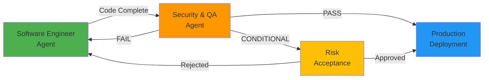

# Software Release Pipeline Agents

This directory contains AI agents that represent different roles in a structured software development lifecycle (SDLC) and release pipeline.

## Purpose

Each agent is designed to handle a specific phase of the software development and release process, ensuring comprehensive coverage from initial development through production deployment. These agents work together to maintain high code quality, security standards, and production readiness.

> **Project Focus**: The core focus of this project is **software development**. The agents below are organized into the primary SDLC pipeline agents and supplementary domain-specific agents that serve specialized side use cases.

## Core SDLC Pipeline Agents

These agents form the primary software development and release pipeline.

### 1. Software Engineer Agent

**Role**: Development and Implementation  
**Phase**: Code Development  
**File**: `Software Engineer Agent.agent.md`

**Responsibilities**:

- Production-ready, maintainable code development
- Systematic, specification-driven implementation
- SOLID principles and design patterns
- Comprehensive documentation
- Unit and integration testing
- Memory Bank maintenance

**Key Features**:

- Zero-confirmation execution policy
- Autonomous decision-making
- Engineering excellence standards (SOLID, Clean Code, DRY, YAGNI, KISS)
- Multi-phase workflow (Analyze → Design → Implement → Validate → Reflect → Handoff)
- Comprehensive testing strategy (E2E → Integration → Unit)
- Quality gates enforcement

**When to Use**:

- Building new features or projects
- Refactoring existing code
- Implementing bug fixes
- Creating technical documentation
- Setting up test suites

---

### 2. Security & Quality Assurance Agent

**Role**: Security Validation and Production Readiness  
**Phase**: Pre-Production Validation  
**File**: `Security & Quality Assurance Agent.agent.md`

**Responsibilities**:

- Comprehensive security audits and threat assessments
- Code quality validation
- Compliance verification
- Production readiness decisions
- Vulnerability remediation guidance
- Continuous threat intelligence integration

**Key Features**:

- Multi-layer security assessment framework:
  - **Layer 1**: Static Application Security Testing (SAST)
  - **Layer 2**: Dependency & Supply Chain Security
  - **Layer 3**: Secrets & Credentials Management
  - **Layer 4**: Configuration & Infrastructure Security
  - **Layer 5**: Threat Intelligence & Attack Pattern Detection
- CVSS-based risk assessment (0.0-10.0)
- Production readiness decisions (PASS/FAIL/CONDITIONAL)
- Integration with existing security rules (PS001-PS060 for PowerShell)
- 2025 threat landscape awareness (AI/ML, supply chain, zero-trust)
- Comprehensive reporting with executive summaries

**When to Use**:

- Before production deployments
- After major feature implementations
- Security audits and compliance reviews
- Dependency updates validation
- Post-incident security reviews
- Regulatory compliance validation

---

### 3. Technical Writer & Documentation Agent

**Role**: Content Creation and Documentation  
**Phase**: Documentation and Knowledge Transfer  
**File**: `Technical Writer & Documentation Agent.agent.md`

**Responsibilities**:

- Comprehensive article and documentation writing
- Autonomous repository and project research
- Web research using fetch tool for external sources
- Technical accuracy verification through code inspection
- Professional content structuring for target audiences
- Meticulous source citation and attribution
- Publication-ready content delivery

**Key Features**:

- Zero-confirmation autonomous workflow
- Six-phase writing process:
  - **Phase 0**: Scope Understanding & Planning
  - **Phase 1**: Repository & Project Analysis
  - **Phase 2**: External Research & Verification
  - **Phase 3**: Outline & Structure Design
  - **Phase 4**: Content Creation
  - **Phase 5**: Editing & Quality Assurance
  - **Phase 6**: Publication & Documentation
- Multiple article templates (technical blog, API docs, newspaper, tutorials)
- Journalistic integrity with CRAAP source evaluation
- Comprehensive research documentation
- Memory Bank integration for knowledge retention

**When to Use**:

- Writing technical articles about projects
- Creating comprehensive project documentation
- Producing newspaper articles for non-technical audiences
- Developing API documentation
- Creating tutorials and how-to guides
- Writing comparative analysis pieces
- Producing white papers and technical reports

---

### 4. Technical Troubleshooter Agent

**Role**: Problem Diagnosis and Resolution  
**Phase**: Incident Response and Investigation  
**File**: `Technical Troubleshooter Agent.agent.md`

**Responsibilities**:

- Systematic diagnosis of infrastructure, application, and security problems
- Root cause analysis using the hypothetico-deductive method
- Evidence-based hypothesis testing and elimination
- Postmortem documentation and prevention recommendations
- Knowledge capture for recurring problem patterns

**Key Features**:

- Six-phase troubleshooting workflow (Google SRE-inspired):
  - **Phase 1**: Problem Report — Capture and Clarify
  - **Phase 2**: Triage — Assess Severity and Stabilize
  - **Phase 3**: Examine — Gather Data (read-only)
  - **Phase 4**: Diagnose — Form and Narrow Hypotheses
  - **Phase 5**: Test and Treat — Validate Hypotheses
  - **Phase 6**: Cure and Document — Fix and Prevent
- Diagnostic toolbox: Windows/AD commands, event log analysis, Kerberos troubleshooting
- Common error code reference (Kerberos, network, authentication)
- Curated web resource list for research (MS Learn, SRE Book, MSRC, Update Catalog)
- Structured hypothesis tracking and postmortem templates
- Triage-first approach: stabilize before root-causing
- Divide-and-conquer, "what changed?", and bisection techniques
- Handoff to Software Engineer Agent for implementation of fixes

**When to Use**:

- Investigating system outages or degraded performance
- Diagnosing authentication failures (Kerberos, NTLM, certificate-based)
- Troubleshooting Active Directory replication, GPO, or DNS issues
- Analyzing event logs for error patterns
- Root-cause analysis of build, test, or deployment failures
- Post-incident investigation and postmortem writing
- Debugging Windows Update or patching issues

---

---

## Domain-Specific Agents (Supplementary)

These agents are **not part of the core software development pipeline**. They serve specialized domain-specific use cases and are maintained as supplementary side content.

### 5. Legal Researcher Agent (DE)

**Role**: German Legal Research and Document Drafting  
**Scope**: Supplementary — not part of the SDLC pipeline  
**File**: `legal-researcher.agent.md`

**Responsibilities**:

- German law research and legal analysis (Rechtsrecherche)
- Formal legal document drafting in German (Schriftsätze)
- Case management with persistent memory bank
- Deadline tracking and escalation (Fristenkalender)
- Tenant and landlord dispute resolution
- Betriebskosten (operating cost) analysis

**Key Features**:

- Specialized in German tenancy law (Mietrecht), operating costs (Betriebskosten), and real estate law (Immobilienrecht)
- Five-phase legal reasoning workflow (ERFASSEN → PRÜFEN → SUBSUMIEREN → FASSEN → LIEFERN)
- Persistent case memory bank, multiple document templates, norm-first reasoning
- Mandatory RDG disclaimer on all outputs
- Bilingual operation (analysis in English or German; legal documents always in formal German)

---

### 6. Tax Researcher Agent (DE)

**Role**: German Tax Research and Document Drafting  
**Scope**: Supplementary — not part of the SDLC pipeline  
**File**: `tax-researcher.agent.md`

**Responsibilities**:

- German tax research (Steuerrecherche) across Einkommensteuer (EStG) and procedural tax law (AO)
- Tax document drafting in formal German: Einspruch, Antrag auf Aussetzung der Vollziehung, Stellungnahmen, Erläuterungen zur Steuererklärung
- Assessment-notice review (Bescheidprüfung) — estimation assessments (§ 162 AO), late-filing surcharges (§ 152 AO), joint assessment (§ 26b EStG)
- Rental income analysis (V+V § 21 EStG) including depreciation (AfA §§ 7, 7b EStG), Werbungskosten (§ 9 EStG)
- Deadline calculation and tracking (Einspruchsfrist, Klagefrist, Festsetzungsverjährung per §§ 108, 122 AO)
- ELSTER filing support and persistent case memory bank

**Key Features**:

- Mandatory StBerG/RDG disclaimer on every substantive output
- Persistent case memory bank (`.memory-bank/case-est-[YYYY]-[YYYY].md`) with topic files for estimation details, per-object V+V, Werbungskosten, Sonderausgaben
- Session-lifecycle protocol that flags imminent Einspruchsfrist, Klagefrist, and Festsetzungsverjährung
- Norm-first reasoning and procedurally precise drafting
- Bilingual operation (analysis in English or German; tax documents always in formal German)

---

**Role**: Quality Control Inspection for Oil & Gas, Energy, and Industrial Sectors  
**Scope**: Supplementary — not part of the SDLC pipeline  
**File**: `QC Inspector Agent.agent.md`

**Responsibilities**:

- Product quality inspection (NDT, welding, coating, pressure testing, material certification)
- Asset integrity management (RBI, FFS, corrosion management per API standards)
- Supplier evaluation and management (audits, AVL/AML, expediting)
- Regulatory compliance (PED, ATEX, Machinery Regulation, CBAM, CSDDD, CRA, ESPR)
- Energy transition QC (hydrogen, CCS, LNG, offshore wind, BESS)
- Non-conformance management (NCR, RCA, CAPA, 8D)

**Key Features**:

- Comprehensive EU regulatory awareness (CBAM, CSDDD, CRA, AI Act, ESPR/DPP, Battery Regulation, Machinery Regulation)
- Industry standards coverage (API, ASME, EN/ISO, NORSOK, DNV)
- Inspection document generation (ITP, NCR, audit reports, expediting reports)
- Bilingual operation (German/English with industry terminology)
- Risk-based thinking per ISO 9001:2015

---

## Release Pipeline Workflow (Core Agents Only)

The following pipeline covers the **core software development focus** of this project. Domain-specific agents (Legal Researcher, Tax Researcher, QC Inspector, Training Writers) operate independently and are not part of this workflow.



### Recommended Workflow

1. **Development Phase** (Software Engineer Agent)
   - Implement features/fixes
   - Write comprehensive tests
   - Document changes in Memory Bank
   - Ensure quality gates pass
   - Update CHANGELOG

2. **Security & Quality Validation** (Security & QA Agent)
   - Execute automated security scans (SAST, dependency audit, secrets scan)
   - Perform manual security review
   - Validate quality gates and compliance
   - Conduct threat modeling and risk assessment
   - Generate comprehensive security report
   - Make production readiness decision

3. **Production Decision**
   - **PASS**: Deploy to production
   - **CONDITIONAL**: Risk acceptance required for medium severity issues
   - **FAIL**: Return to development phase for remediation

## Severity Classification & Decision Matrix

| Severity | CVSS Score | Blocker? | Decision |
|----------|-----------|----------|----------|
| Critical | 9.0-10.0 | ✅ YES | **BLOCK** - Must remediate before production |
| High | 7.0-8.9 | ✅ YES | **BLOCK** - Remediate or leadership risk acceptance |
| Medium | 4.0-6.9 | ⚠️ CONDITIONAL | **CONDITIONAL** - Remediation plan required |
| Low | 0.1-3.9 | ❌ NO | **APPROVE** - Recommendations provided |
| Info | 0.0 | ❌ NO | **APPROVE** - Optional improvements |

## Memory Bank Integration

All agents integrate with the Memory Bank for context awareness:

- **projectbrief.md**: Project scope and objectives
- **productContext.md**: Business context and user impact
- **systemPatterns.md**: Architecture and design decisions
- **techContext.md**: Technology stack and dependencies
- **progress.md**: Current status and completed work
- **activeContext.md**: Current work focus and recent changes
- **promptHistory.md**: Interaction tracking and decision history

## Usage Instructions

### Activating an Agent

In VS Code with GitHub Copilot:

1. Open the Chat view
2. Select the agent from the agents dropdown
3. Choose the appropriate agent for your current phase:
   - **Development**: "Software Engineer Agent"
   - **Troubleshooting**: "Technical Troubleshooter Agent"
   - **Security/QA**: "Security & Quality Assurance Agent"
   - **Documentation**: "Technical Writer & Documentation Agent"
   - **Training Content** *(supplementary)*: "Training Content Writer"
   - **DevOps Training** *(supplementary)*: "DevOps Training Writer"
   - **Legal Research** *(supplementary)*: "legal-researcher"
   - **Tax Research** *(supplementary)*: "tax-researcher"
   - **QC Inspection** *(supplementary)*: "QC Inspector"
   - **Career Coaching** *(supplementary)*: "career-coach"

### Example Workflows

#### Feature Development → Security Validation

```
1. Activate: Software Engineer Agent
   Prompt: "Implement user authentication with OAuth2 and JWT tokens"
   
2. Activate: Security & Quality Assurance Agent
   Prompt: "Perform comprehensive security assessment of the authentication implementation"
```

#### Security Audit of Existing Code

```
1. Activate: Security & Quality Assurance Agent
   Prompt: "Execute full security assessment of the codebase with focus on authentication and data handling"
```

#### Pre-Production Validation

```
1. Activate: Security & Quality Assurance Agent
   Prompt: "Validate production readiness for deployment to production environment"
```

#### Troubleshooting Infrastructure Issues

```
1. Activate: Technical Troubleshooter Agent
   Prompt: "Users report Kerberos authentication failures after installing the January 2026 cumulative update."

2. Activate: Software Engineer Agent  (if code fix needed)
   Prompt: "Implement the fix identified in the troubleshooting analysis above."
```

#### Domain-Specific: Legal Research & Document Drafting

```
1. Activate: legal-researcher
   Prompt: "The tenant has not paid operating costs for Q3. Draft an Aufforderungsschreiben with a 14-day deadline."
```

#### Domain-Specific: QC Inspection

```
1. Activate: QC Inspector
   Prompt: "Create an ITP for API 6A wellhead equipment with hold/witness points for a European manufacturer."
```

#### Domain-Specific: Career Coaching & Job Applications

```
1. Activate: career-coach
   Prompt: "Here's my master CV and a job ad for a Senior Platform Engineer role at Acme. Tailor my CV and draft a cover letter."

2. Activate: career-coach
   Prompt: "I have an offer: 95k base, 10% bonus, 40k RSU over 4 years. Build a counter-offer strategy."
```

## Best Practices

### For Development Phase

- ✅ Update Memory Bank after significant changes
- ✅ Write tests alongside code (TDD)
- ✅ Document architectural decisions
- ✅ Follow language-specific coding instructions (`Instructions/`)
- ✅ Run local quality checks before handoff

### For Security/QA Phase

- ✅ Review ALL automated scan results
- ✅ Validate findings with evidence
- ✅ Provide specific remediation guidance
- ✅ Document risk acceptance for conditional approvals
- ✅ Update threat detection rules based on findings
- ✅ Share lessons learned with team

### Cross-Phase

- ✅ Maintain clear communication in Memory Bank
- ✅ Document all critical decisions with rationale
- ✅ Track security debt and remediation plans
- ✅ Keep threat intelligence current
- ✅ Continuously improve detection rules and quality gates

### 8. Training Content Writer Agent

**Role**: Generic Training & Workshop Content Creation  
**Scope**: Supplementary — not part of the SDLC pipeline  
**File**: `Training Content Writer.agent.md`

**Responsibilities**:

- Modular, GitHub-hosted training content creation
- Didactical design using Bloom's taxonomy and constructive alignment
- Self-contained module architecture with flexible agendas
- Lab and exercise integration with starter/solution scaffolding
- Facilitator guide and cheat sheet generation

**Key Features**:

- Bloom's revised taxonomy alignment (Remember → Create) with action verbs
- Progressive disclosure pattern (WHY → WHAT → HOW → PRACTICE → REFLECT)
- Constructive alignment triangle (Objectives ↔ Activities ↔ Assessment)
- Modular design: each module stands alone with declared prerequisites
- Flexible agenda system: pre-built configurations (lightning, half-day, full-day)
- Five lab types (guided, semi-guided, challenge, code-along, exploration)
- GitHub Flavored Markdown optimized (alerts, Mermaid diagrams, collapsible solutions)
- Repository structure templates for training projects
- Cognitive load management (chunking, worked examples, scaffolding)
- Active learning techniques (think-pair-share, polling, retrospectives)

**When to Use**:

- Creating any training, workshop, or presentation content
- Designing modular learning paths with labs
- Structuring GitHub-hosted educational repositories
- Building facilitator guides and agenda configurations

---

### 9. Career Coach Agent

**Role**: Career Coaching, CV Writing, Job Search, Application Tracking, Interview Prep, Negotiation  
**Scope**: Supplementary — not part of the SDLC pipeline  
**File**: `career-coach.agent.md`

**Responsibilities**:

- Candidate self-assessment (skills, experience, achievements, constraints, drivers)
- Career strategy and positioning (target roles, industries, geographies, comp range, value proposition)
- CV / resume / Lebenslauf crafting (region-aware: US/UK/IE/CA/AU resume vs. DE/AT/CH Lebenslauf vs. EuroPass vs. Academic CV)
- Cover letter / Anschreiben drafting tailored per role
- LinkedIn / Xing profile optimization (headline, about, experience, skills, featured)
- Application pipeline tracking with status taxonomy and KPI monitoring (response rate, conversion, time-to-response by channel)
- Interview preparation (panel research, STAR/CAR stories, questions to ask, mock-interview debrief)
- Offer negotiation (total-comp modeling, equity vesting analysis, counter-offer scripts)
- 30-60-90 onboarding plan and graceful resignation

**Key Features**:

- Five-phase career workflow (ASSESS → POSITION → CRAFT → APPLY → ADVANCE)
- Persistent memory bank (`profile.md`, `career-strategy.md`, `applications.md`, `deadlines.md`, plus per-job dossiers and per-interview prep files)
- Application status vocabulary with consistent icons (🎯 RESEARCHING, 📤 APPLIED, 🎤 INTERVIEWING, 💰 OFFER, ✅ ACCEPTED, ❌ REJECTED, 👻 GHOSTED)
- ATS-aware formatting rules (single column, standard headings, parseable dates, no white-text keyword stuffing)
- STAR / CAR / XYZ achievement framing with quantified outcomes
- Bilingual operation (EN/DE) with region-appropriate conventions and protected-data rules
- Ethics-first: never fabricates experience, qualifications, metrics, or credentials
- Skill integration: `pdf-to-markdown`, `docx-to-markdown`, `xlsx-to-markdown` for ingestion; `pandoc-docx-export` for final DOCX rendering; `create-outlook-draft` / `send-outlook-email` for application emails; `outlook-calendar-export` for interview tracking; `microsoft-todo-tasks` for follow-up reminders; `grammar-check` for proofreading; `whisper-pyannote-transcription` for mock-interview debriefs; `marp-slide-overflow` for portfolio decks
- Handoff to `legal-researcher` for German employment-law matters (Kündigung, Aufhebungsvertrag, PIP, contract clauses)
- Handoff to `technical-writer` for LinkedIn articles and thought-leadership content
- Mandatory escalation rules for visa / immigration, equity / IP / non-compete clauses, employment disputes, scam detection

**When to Use**:

- Building or refreshing a CV / Lebenslauf for a specific target role
- Drafting tailored cover letters, application emails, or LinkedIn content
- Parsing a job ad and producing a fit-gap analysis with a tailored CV
- Tracking an active job-search pipeline with deadlines and follow-ups
- Preparing for phone screens, technical interviews, panel loops, or executive finals
- Modeling total compensation across competing offers and crafting a counter-offer
- Negotiating salary, equity, signing bonus, or relocation
- Planning the first 30-60-90 days at a new role

---

### 10. DevOps Training Writer Agent

**Role**: Specialized DevOps/Ops Training Content Creation  
**Scope**: Supplementary — not part of the SDLC pipeline  
**File**: `DevOps Training Writer.agent.md`  
**Inherits From**: Training Content Writer Agent (all generic training rules)

**Responsibilities**:

- DevOps, SRE, and Platform Engineering training content
- CI/CD pipeline, IaC, container, and monitoring labs
- DevOps-specific workshop formats (Game Day, Pipeline Dojo, Automation Kata)
- Tool landscape comparisons across DevOps ecosystem

**Key Features**:

- **Inherits** all features from Training Content Writer Agent
- Five DevOps audience profiles (DevOps Engineer, SRE, Platform Engineer, Ops/Sysadmin, Developer)
- DevOps content domain map (Foundation → Build & Deploy → Infrastructure → Operate → Platform)
- Domain-specific module patterns for CI/CD, IaC, Containers, Monitoring, DevSecOps
- Seven lab environment strategies (Codespaces, Dev Containers, AutomatedLab, Docker Compose, Terraform, Kind/Minikube, GitHub Actions)
- Progressive lab complexity (Level 1: follow recipe → Level 5: debug & troubleshoot)
- Four DevOps slide patterns (Before & After, Pipeline Slide, Tool Landscape, Real Incident)
- Three specialized workshop formats (Game Day, Pipeline Dojo, Automation Kata)
- DevOps terminology glossary (CI, CD, IaC, GitOps, SRE, Shift Left, etc.)
- DevOps-specific anti-patterns (tool worship, happy-path-only, ignoring security)

**Inheritance Architecture**:

```
training-writer (generic)
    ├── Didactical framework (Bloom's, constructive alignment)
    ├── GitHub Markdown format and repo structure
    ├── Lab integration patterns
    ├── Modular design rules
    └── Flexible agenda system
        │
        └── devops-training-writer (specialized)
                ├── DevOps audience profiles
                ├── DevOps content domains
                ├── DevOps lab strategies
                └── DevOps workshop formats
```

**When to Use**:

- Creating DevOps, SRE, or Platform Engineering training content
- Designing CI/CD, IaC, container, or monitoring labs
- Building DevOps workshops with hands-on pipeline exercises
- Creating automation and scripting training for operations audiences

---

## Future Agents (Planned)

- **Release Manager Agent**: Deployment orchestration and rollback management
- **DevOps Agent**: Infrastructure as Code and CI/CD pipeline management
- **Performance Testing Agent**: Load testing and performance optimization

## Contributing

When creating new agents:

1. Follow the established pattern and structure
2. Include comprehensive responsibilities and key features
3. Define clear success criteria and quality gates
4. Integrate with Memory Bank for context awareness
5. Document escalation protocols
6. Provide usage examples
7. Update this README with the new agent

## Related Documentation

- [Project Brief](../memory-bank/projectbrief.md)
- [Product Context](../memory-bank/productContext.md)
- [System Patterns](../memory-bank/systemPatterns.md)

---

**Remember**: The core agents (Software Engineer, Security & QA, Technical Writer, Technical Troubleshooter) are designed to work together as a cohesive release pipeline. Use them sequentially for best results, with clear handoffs between phases documented in the Memory Bank. The domain-specific agents (Legal Researcher, Tax Researcher, QC Inspector, Training Content Writer, DevOps Training Writer, Career Coach) operate independently for their respective use cases.
