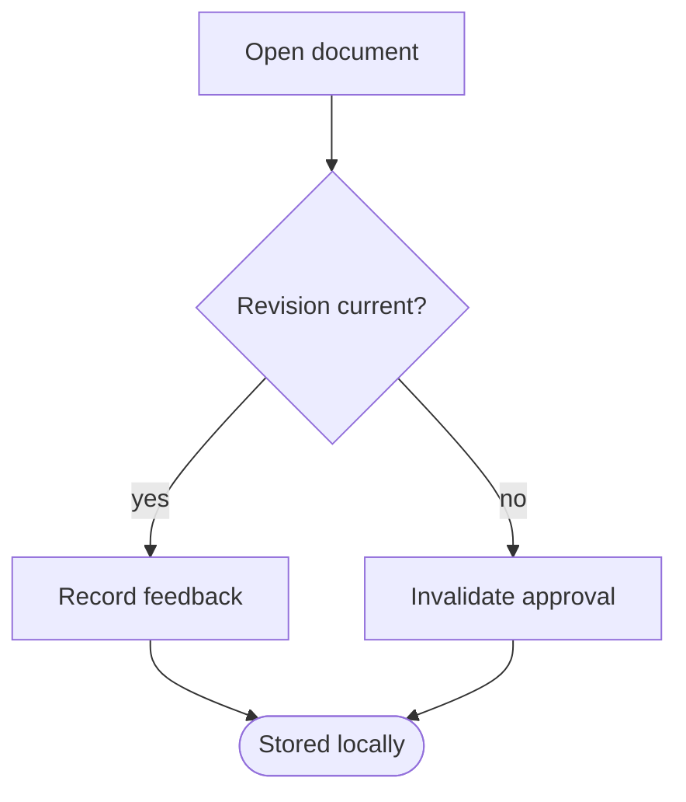
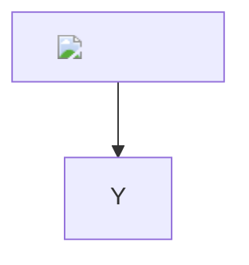

# Renderer fixture — plan review browser checks

Intro before the first heading, so the preamble section has content.

## Scope

This section carries an anchored comment during the browser run.

Text with `inline code`, **bold**, and a [link](https://example.com/spec).

| Column | Meaning |
|---|---|
| One | First |
| Two | Second |

## Diagram

## Unsafe input

[javascript link](javascript:window.__planReviewInjected = true)

## Removable

This whole section is deleted during the browser run to prove that a comment on
it becomes unanchored rather than moving to different content.
