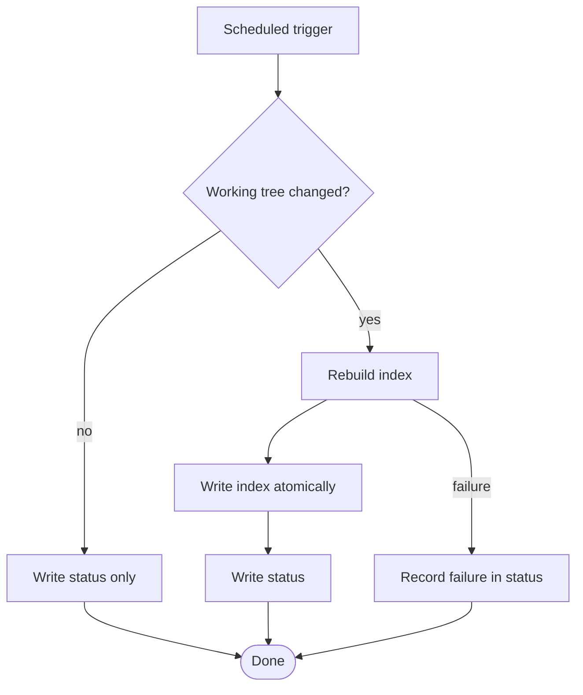

# Sample Design Concept — nightly index refresh (DEMONSTRATION ONLY)

> **This document is a fixture.** It exists so the local review surface has real
> content and a real diagram to render. It describes no planned work, it is not
> a Decision record, and approving it in the browser approves nothing. Real
> Design Concepts live in `.memory-bank/topics/` and are signed off in chat.

## Purpose

Refresh a local search index once per night so a stale index stops being the
first thing a new contributor notices.

## Scope

- A scheduled local job that rebuilds the index from the working tree.
- A status file the tooling can read to tell how old the index is.

## Non-goals

- No hosted index, no remote sync, and no telemetry.
- No incremental or watch-based indexing in this iteration.

## Stakeholders

| Role | Interest |
|---|---|
| Contributor | Search results that match the checkout |
| Maintainer | A job that fails loudly instead of silently skipping |

## Inputs

Tracked files under the repository root, excluding build output.

## Outputs

An index file and a status file, both under the local state folder.

## Quantified requirements

| Quality | Scale | Meter | Past | Goal |
|---|---|---|---|---|
| Freshness | Age of the index when a search runs | Status file timestamp | 9 days | < 24 hours |
| Build cost | Wall-clock seconds for a full rebuild | Job log | 41 s | < 60 s |
| Failure visibility | Share of failed runs that surface a message | Job log review | 0 % | 100 % |

## Design options and recommendation

Recommended: rebuild on change, always write a status record. The runner-up —
rebuild unconditionally — is simpler but spends the full build cost on nights
where nothing changed, and it still needs the status record.

## Failure modes

- The rebuild crashes midway. The atomic write means the previous index stays
  readable and the status file records the failure.
- The state folder is missing. The job creates it, and refuses if the path
  resolves outside the declared root.

## Edge cases

- An empty working tree produces an empty index rather than an error.
- Two runs overlapping is prevented by a lock rather than by hoping.

## Security

The job reads only tracked files and writes only inside the state folder. It
opens no network connection and executes nothing from the working tree.

## Performance

A full rebuild is bounded at 60 seconds; beyond that the job aborts and records
a timeout in the status file.

## Observability

The status file carries the last run's start time, duration, outcome, and file
count. That is the whole observability surface for this iteration.

## Rollback

Delete the scheduled job and the state folder. Nothing else changes.

## Acceptance criteria

- A run on an unchanged tree writes a status record and does not rebuild.
- A run on a changed tree produces an index whose file count matches the tree.
- A failed run leaves the previous index readable and records the failure.
- Two concurrent runs do not both rebuild.

## Open questions

- TBD (fixture): whether the status file belongs next to the index or in the
  repository root. Owner: nobody — this document is a demonstration fixture.

## Sign-off

Not signed off, and not signable here. This section exists so the sample has the
same shape as a real Design Concept.
